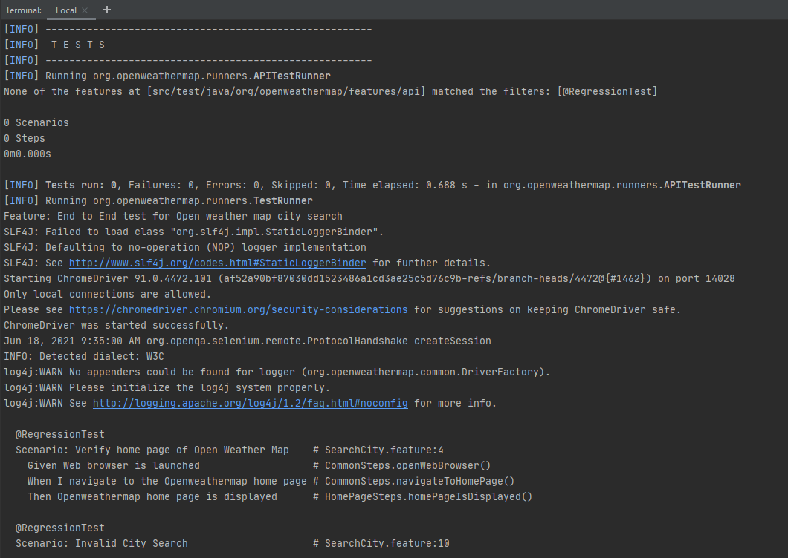
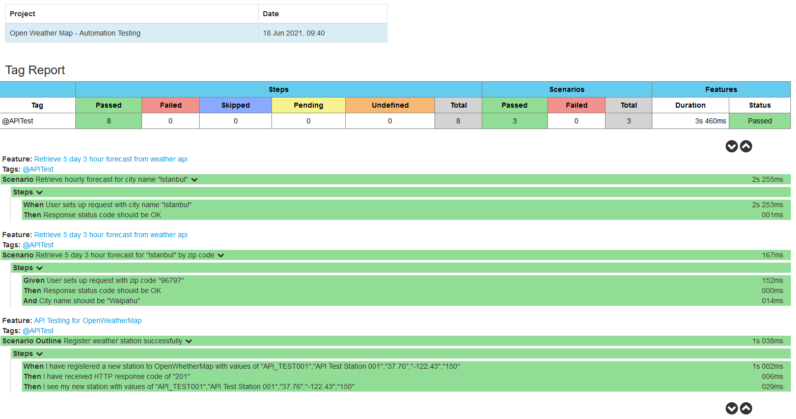

# **Open Weather Map - Automation Testing**
This Test Framework Example in Java language using Java libraries; RestAssured (for API Service) and Cucumber (for BDD styled), along with Maven as a build tool.

##   Table of Contents
* [Overview](#overview)
* [How to setup test environment](#howtosetup)
* [How to run tests and generate reports](#howtoruntests)
* [Where to find Reports](#reports)
* [Jenkins (CI/CD) Integration setup guideline](#jenkins)
* [Examples of Test Execution and HTML report](#outputexamples)
___
<a name="overview"></a>
### 1. Overview 

* This automation test framework uses Java as a main language with 'RestAssured' and 'Cucumber' libraries 

* Test will run according to feature files - which are stored under 
./src/test/java/org/openweathermap/features folder. 

* Outputs (Json and html files) will be produced under ./target/cucumber-reports folder.
___
<a name="howtosetup"></a>
### 2. How to set up test environment

Pull (clone) source code from Git as below command: 

```
git clone git@github.com:jezdang/automation-selenium.git
```

Then tests can be run as mentioned in the next step.

> Note: Git client and Maven are required to setup and run
> * [Git Installation](https://www.atlassian.com/git/tutorials/install-git)
> * [Apache Maven Installation](http://maven.apache.org/install.html/) 
--- 
<a name="howtoruntests"></a>

### 3. How to run tests and generate reports
**3.1 Run all tests** 

Run CLI: <code>mvn verify</code> to build and execute all tests

```batch
mvn verify
```
**3.2 Run all tests on Web (UI)** 
 
 Run CLI: <code>mvn verify -Dcucumber.options="--tags @RegressionTest"</code> to build and execute Functional tests

```batch
mvn verify -Dcucumber.options="--tags @RegressionTest"
```

**3.3 Run all API tests** 

Run CLI: <code>mvn verify -Dcucumber.options="--tags @APITest"</code> to build and execute API tests

```batch
mvn verify -Dcucumber.options="--tags @APITest"
```

Once finished, there will be reports in ./target/cucumber-reports/ folder.   

---
<a name="reports"></a>
### 4. Where to find reports

**4.1 Raw report of Cucumber**
* JSON file: ./target/cucumber-reports/cucumber.json
* HTML file: ./target/cucumber-reports/html/index.html

**4.2 Beautiful generated report**
* HTML file: ./reports/newest_report/cucumber-html-reports/report-***.html
> Note: 
> 1. To view report by each feature file: "_report-feature_***.html_"
> 2. To view report by tag (RegressionTest or APITest): "_report-tag_RegressionTest.html_" or "_report-tag_APITest.html_"
---
<a name="jenkins"></a>
## 5. Jenkins (CI/CD) Integration setup guideline
In your new Jenkins Job:

**5.1 Source code Management**

Under Git Integration: pull source code from github:
        
```git
git clone git@github.com:jezdang/automation-selenium.git
```

**5.2 Run test** 

Add step: to run maven (build and run goal as 'verify')

Two options:  

   * Run all test scenarios define in all feature files
        ```batch
        mvn verify 
        ```  
   * Run with selected browser (ex: Firefox)
        
        ```batch
        mvn verify -DbrowserName="firefox"
        ```

5.3 If needed, JUnit and HTML reports can be used for further integrations (Jenkins build itself or other integrations; such as Jira.
* JUnit file: ./target/cucumber-reports/Runner-Cucumber-Log.xml
* HTML file: ./target/cucumber-reports/html/index.html
---
<a name="jenkins"></a>
## 6. Example of Test Execution and Cucumber Reports
**Test Execution:**


**Cucumber Report:**  

